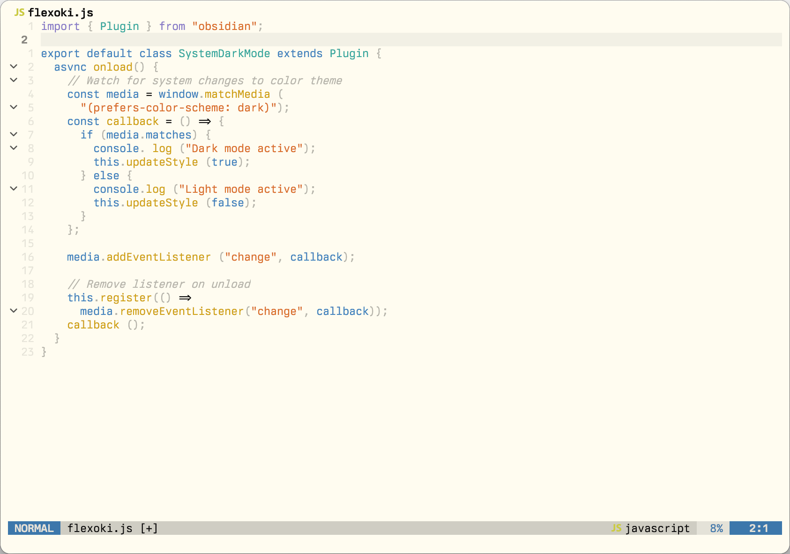

# `flexoki-dove.nvim`

`flexoki-dove.nvim` is a neutral-gray, light-only fork of [`kepano/flexoki-neovim`](https://github.com/kepano/flexoki-neovim), a Neovim adaptation of [Flexoki](https://stephango.com/flexoki) by Steph Ango.



## Installation

Use your preferred plugin manager, such as **[folke/lazy.nvim](https://github.com/folke/lazy.nvim)**:

```lua
{
  "reobin/flexoki-dove.nvim",
  lazy = false,
  priority = 1000,
  opts = {}
}
```

## Usage

```lua
vim.cmd('colorscheme flexoki-dove')
```
